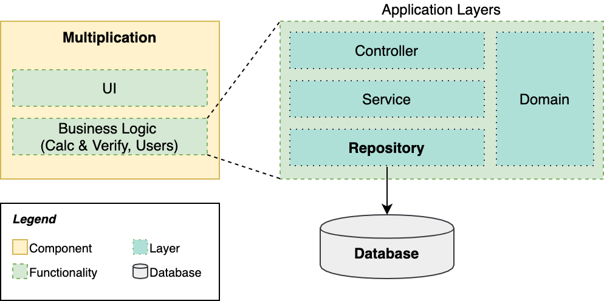
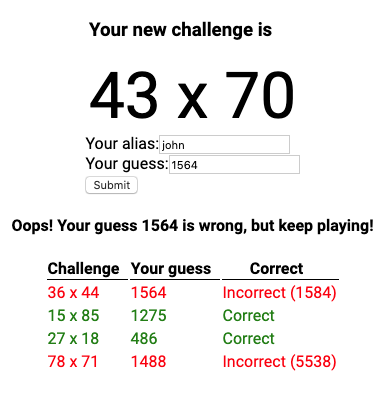

# Learn Microservices with Spring Boot - Chapter 5

This repository contains the source code of the practical use case described in the book [Learn Microservices with Spring Boot (2nd Edition)](https://tpd.io/book-extra).

The book follows a pragmatic approach to building a Microservice Architecture. You start with a small monolith and examine the _pros_ and _cons_ that come with a move to microservices. 

## Chapter 5 version

In Chapter 5, you add a persistence layer to the Multiplication's Spring Boot application, following the 3-layer, 3-tier design patterns. The figure below shows the data model for our application.


The main concepts included in this chapter are:

* Modeling Data Entities
* Introducing SQL vs NoSQL, Hibernate, and JPA.
* Covering the main topics about Spring Boot Data JPA, from a practical perspective.
* Defining JPA Entities for our use case.
* Reviewing how the 3 layers work together: Controller, Service, Repository.

All these topics are driven by a new feature that you introduce in the evolving app: retrieve the historical data for the attempts of a given user.

You use an H2 embedded database in the implementation, which means you don't need to install anything extra to run the complete system.

The next figure shows the logical view of our application at this stage.



Check the [Book's Web Page](https://tpd.io/book-extra) to see the complete list of chapters.

## Running the app

Requirements:

* JDK 14+
* Node.js v13.10+
* npm 6.13.7+

1. To start the Spring Boot application, you can use the command line with the included Maven wrapper:
    ```bash
    multiplication$ ./mvnw spring-boot:run
    ```
2. The React application can be started with npm. First, you need to download the dependencies with:
    ```bash
    challenges-frontend$ npm install
    ```
3. Then, you start the server with:
    ```bash
    challenges-frontend$ npm start
    ```

Once the backend and the fronted are started, you can navigate to `http://localhost:3000` in your browser and start resolving multiplication challenges. This time, you'll see a new table that displays your previous attempts.



Additionally, you can access the H2 Console if you want to manage or query the database. The console is located at [http://localhost:8080/h2-console](http://localhost:8080/h2-console). 

## Questions

* Do you have questions about how to make this application work?
* Did you get the book and have questions about any concept explained within this chapter?
* Have you found issues using updated dependencies?

Don't hesitate to create an issue in this repository and post your question/problem there. 

## About the book

Are you interested in building a microservice architecture from scratch? You'll face all the challenges of designing and implementing a distributed system one by one, and will be able to evaluate if it's the best choice for your project.

Visit [https://tpd.io/book-extra](https://tpd.io/book-extra) for all the details about the book.

### Purchase

You can **buy the book online** from these stores:

* [Apress](https://www.kqzyfj.com/click-8535631-14029332?url=https%3A%2F%2Fwww.apress.com%2Fgp%2Fbook%2F9781484261309)
* Amazon (coming soon)
* Other stores (coming soon)

### Source code by chapter (all repositories are available on Github)

* [Chapter 3. A professional 3-tier 3-layer Spring Boot app](https://github.com/Book-Microservices-v2/chapter03)
* [Chapter 4. Building a basic frontend in React (backender-friendly)](https://github.com/Book-Microservices-v2/chapter04)
* [Chapter 5. The Data Layer Concepts and Spring Data JPA](https://github.com/Book-Microservices-v2/chapter05)
* [Chapter 6. Starting with Microservices - Synchronous](https://github.com/Book-Microservices-v2/chapter06)
* [Chapter 7. Event-Driven Architectures - Making our system asynchronous](https://github.com/Book-Microservices-v2/chapter07)
* [Chapter 8 (I). The Gateway Pattern in Microservice Architectures (Spring Cloud Gateway)](https://github.com/Book-Microservices-v2/chapter08a)
* [Chapter 8 (II). Service Discovery and Load Balancing for Spring Boot Microservices (Consul / Spring Cloud Load Balancer)](https://github.com/Book-Microservices-v2/chapter08b)
* [Chapter 8 (III). Centralized Configuration with Consul KV](https://github.com/Book-Microservices-v2/chapter08c)
* [Chapter 8 (IV). Centralized Logs, Distributed Tracing, and Containerization with Docker (Buildpacks) and Docker Compose](https://github.com/Book-Microservices-v2/chapter08d)
