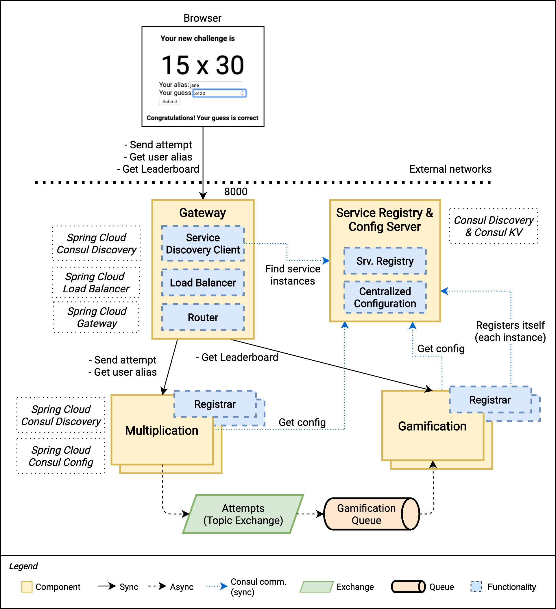
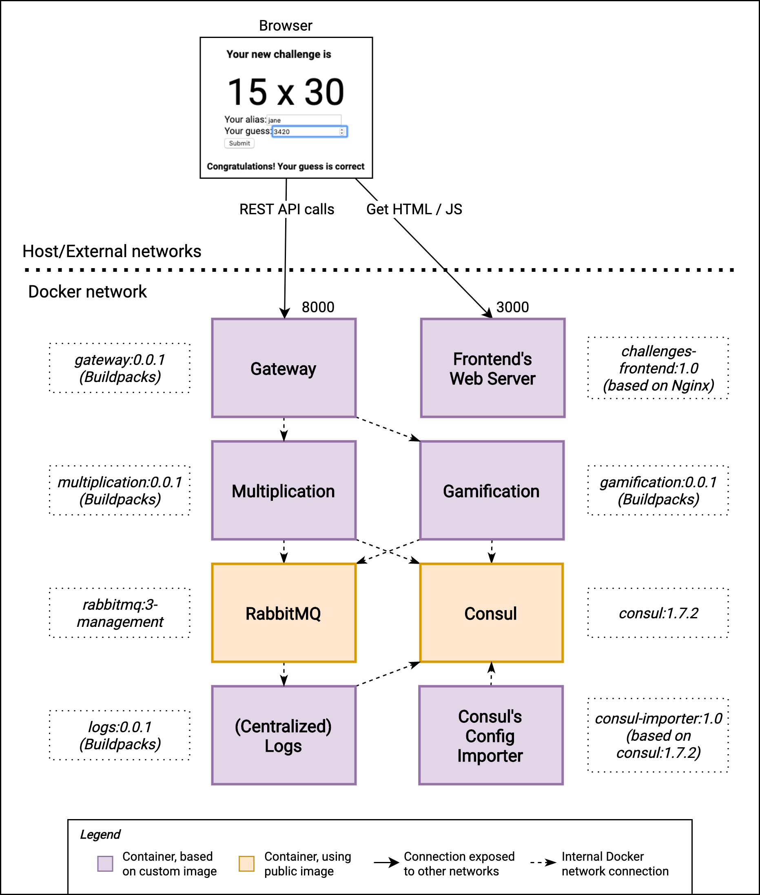

# Learn Microservices with Spring Boot - Chapter 8d (Final - 4/4)

This repository contains the source code of the practical use case described in the book [Learn Microservices with Spring Boot (2nd Edition)](https://tpd.io/book-extra).

The book follows a pragmatic approach to building a Microservice Architecture. You start with a small monolith and examine the _pros_ and _cons_ that come with a move to microservices. 

## Chapter 8 version 4/4 (Book's final version)

The Chapter 8's source code is divided into four parts for a better understanding of how the system evolves when we start introducing _Common Patterns of Microservice Architectures_.

In this last part, we introduce Centralized Logs, Distributed Tracing, and Containerization with Docker and Docker Compose.

The figure below shows a high-level overview of the final version of our system.



The main concepts included in this last part of the chapter are:

* Why do we need Centralized Logs and Distributed tracing?
* Why would I create Docker images for my applications?
* Building a simple logger application with Spring Boot and RabbitMQ.
* Distributed traces with Spring Cloud Sleuth.
* Building Docker images for Spring Boot applications with Cloud Native Buildpacks.
* Container Platforms, Application Platforms, and Cloud Services.

As usual, the book follows a hands-on approach, so you learn everything based on this microservice case study.

Check the [Book's Web Page](https://tpd.io/book-extra) to see the complete list of chapters.

## Running the app

This time, you can use Docker to start the complete system. If you're interested in the instructions to run the components manually, [check the previous version of the repository](https://github.com/Book-Microservices-v2/chapter08c).

If you don't want to build the images yourself, these images are already in the Docker Hub. You can run the complete system using the `docker-compose-public.yml` file:

```bash
docker$ docker-compose -f docker-compose-public.yml up
```

In case you want to learn how to build the images, keep reading the instructions below.

Remember that all these steps are explained in detail [in the book](https://tpd.io/book-extra).

### Building the images yourself

First, build the application images with:

```bash
$ ./mvnw spring-boot:build-image
```

Then, build the consul importer from the `docker/consul` folder:

```bash
docker/consul$ docker build -t consul-importer:1.0 .
```

And the UI server (first you have to build it with `npm run build`):

```bash
challenges-frontend $ docker build -t challenges-frontend:1.0 .
```

Once you have all the images ready, run:

```bash
docker$ docker-compose up
```

See the figure below for a diagram showing the container view.



Once the backend and the frontend are started, you can navigate to `http://localhost:3000` in your browser and start resolving multiplication challenges.

## Playing with Docker Compose

After the system is up and running, you can quickly scale up and down instances of both Multiplication and Gamification services. For example, you can run:

```bash
docker$ docker-compose up --scale multiplication=2 --scale gamification=2
```

And you'll get two instances of each of these services with proper Load Balancing and Service Discovery.

## Questions

* Do you have questions about how to make this application work?
* Did you get the book and have questions about any concept explained within this chapter?
* Have you found issues using updated dependencies?

Don't hesitate to create an issue in this repository and post your question/problem there. 

## About the book

Are you interested in building a microservice architecture from scratch? You'll face all the challenges of designing and implementing a distributed system one by one, and will be able to evaluate if it's the best choice for your project.

Visit [https://tpd.io/book-extra](https://tpd.io/book-extra) for all the details about the book.

### Purchase

You can **buy the book online** from these stores:

* [Apress](https://www.kqzyfj.com/click-8535631-14029332?url=https%3A%2F%2Fwww.apress.com%2Fgp%2Fbook%2F9781484261309)
* Amazon (coming soon)
* Other stores (coming soon)

### Source code by chapter (all repositories are available on Github)

* [Chapter 3. A professional 3-tier 3-layer Spring Boot app](https://github.com/Book-Microservices-v2/chapter03)
* [Chapter 4. Building a basic frontend in React (backender-friendly)](https://github.com/Book-Microservices-v2/chapter04)
* [Chapter 5. The Data Layer Concepts and Spring Data JPA](https://github.com/Book-Microservices-v2/chapter05)
* [Chapter 6. Starting with Microservices - Synchronous](https://github.com/Book-Microservices-v2/chapter06)
* [Chapter 7. Event-Driven Architectures - Making our system asynchronous](https://github.com/Book-Microservices-v2/chapter07)
* [Chapter 8 (I). The Gateway Pattern in Microservice Architectures (Spring Cloud Gateway)](https://github.com/Book-Microservices-v2/chapter08a)
* [Chapter 8 (II). Service Discovery and Load Balancing for Spring Boot Microservices (Consul / Spring Cloud Load Balancer)](https://github.com/Book-Microservices-v2/chapter08b)
* [Chapter 8 (III). Centralized Configuration with Consul KV](https://github.com/Book-Microservices-v2/chapter08c)
* [Chapter 8 (IV). Centralized Logs, Distributed Tracing, and Containerization with Docker (Buildpacks) and Docker Compose](https://github.com/Book-Microservices-v2/chapter08d)
